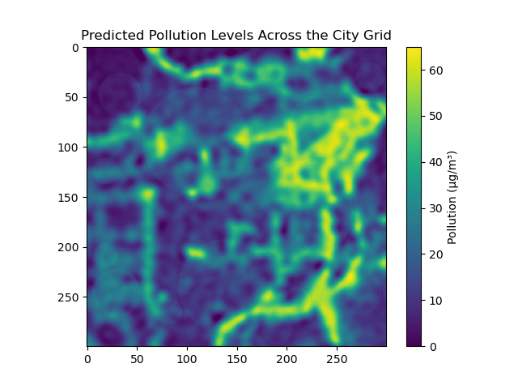
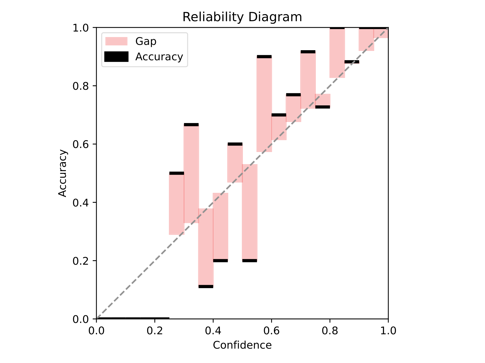
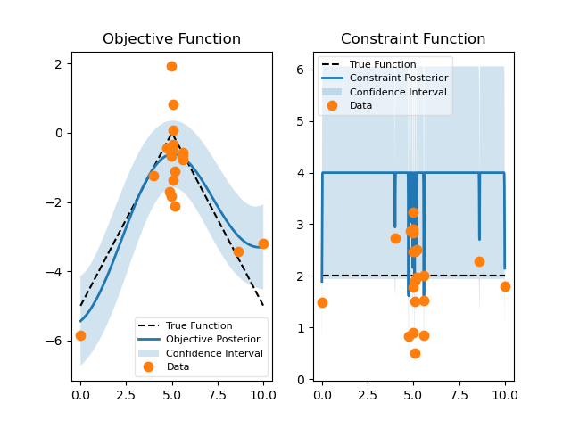

# Probabilistic Artificial Intelligence

## About

Projects from the '263-5210-00L  Probabilistic Artificial Intelligence' course by Prof. Krause.

**Disclaimer:** Task 1 and 2 utilize private datasets that will not be released.

## Projects

### Task 1: Predicting Urban Air Quality with Gaussian Process Regression

In this task, we develop a Gaussian Process Regression (GPR) model equipped with a Radial Basis Function (RBF) kernel to predict PM2.5 pollution levels in urban areas. PM2.5 refers to fine particulate matter that compromises air quality and poses health risks. Accurate predictions of PM2.5 levels can help assess and mitigate its public health impacts.

</img>

### Task 2: Land-Use Classification with SWAG Inference

This task employs Stochastic Weight Averaging-Gaussian ([SWAG](https://doi.org/10.48550/arXiv.1902.02476)) for land-use classification from satellite images using a CNN model. Unlike typical training methods like Stochastic Gradient Descent (SGD), SWAG not only enhances generalization but also provides robust uncertainty estimates. These estimates are particularly useful for identifying ambiguous images.

</img>

### Task 3: Bayesian Optimization for Drug Candidate Optimization

This task utilizes Bayesian Optimization to identify optimal structural features of drug candidates that influence both their bioavailability and ease of synthesis. The algorithm strategically explores parameters that represent these structural features. The goal is to maximize the logP value, which is a measure of bioavailability, while ensuring that the synthetic accessibility score (SA) remains within a defined manageable range (indicating ease of synthesis).

</img>

### Task 4: Reinforcement Learning for Pendulum Swing-Up

This task employs the Soft Actor-Critic ([SAC](https://doi.org/10.48550/arXiv.1801.01290)) algorithm, an off-policy reinforcement learning method, to develop a strategy for swinging up an inverted pendulum from a downward position (π) to an upright position (0) and maintaining it there. SAC optimizes a stochastic policy to maximize reward while encouraging entropy in action selection, which helps balance exploration and exploitation. To control the pendulum, the agent uses a motor that can apply torques ranging from -1 to 1.

<video width="320" height="240" controls src="assets/pendulum_episode.mp4" title="Task 4"></video>

